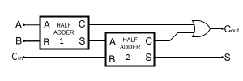

=======================
Circuit Fault Diagnosis
=======================

Fault diagnosis is the combinational problem of quickly localizing failures as soon as they are detected in systems. Circuit fault diagnosis (CFD) is the problem of identifying a minimum-sized set of gates that, if faulty, explains an observation of incorrect outputs given a set of inputs.

.. figure:: ../_static/HA.png
   :name: Half_Adder
   :alt: image
   :align: center

   A Half Adder made up of an XOR gate and an AND gate.

   A Full Adder made up of two Half Adders.

The following example demonstrates some of the techniques available to formulate a given problem so it can be solved on the D-Wave system.

Circuit Fault Diagnosis with Explicit Fault Variables
=====================================================

We can construct the constraints for the circuit fault diagnosis in the following way:

* Each input/output/wire in the circuit is represented by a binary variable in the problem.
* Each gate can either be:
    * Healthy, in which case it behaves according to it's normal truth table.
    * Faulty, in which case it does not.

To build these constraints, we start with the truth table for the gate we wish to encode, say an
AND gate:

=====  =====  ====== 
  A      B    Output 
=====  =====  ====== 
0       0       0 
1       0       0
0       1       0
1       1       1 
=====  =====  ======

We then add a new *explicit fault variable*, which encodes whether the gate is faulty or now.

=====  =====  ====== ========
  A      B    Output  Faulty
=====  =====  ====== ========
0       0       0     0
1       0       0     0
0       1       0     0
1       1       1     0
0       0       1     1
1       0       1     1
0       1       1     1
1       1       0     1
=====  =====  ====== ========

This new truth table with the explicit fault variable allows the CSP to be satisfied even
when the gate is not healthy.

Example Code
------------

The following code demonstrates how to find both fault diagnoses and minimum fault diagnoses
for the above Full Adder.

.. literalinclude:: ../../examples/explicit_circuit_fault_diagnosis.py